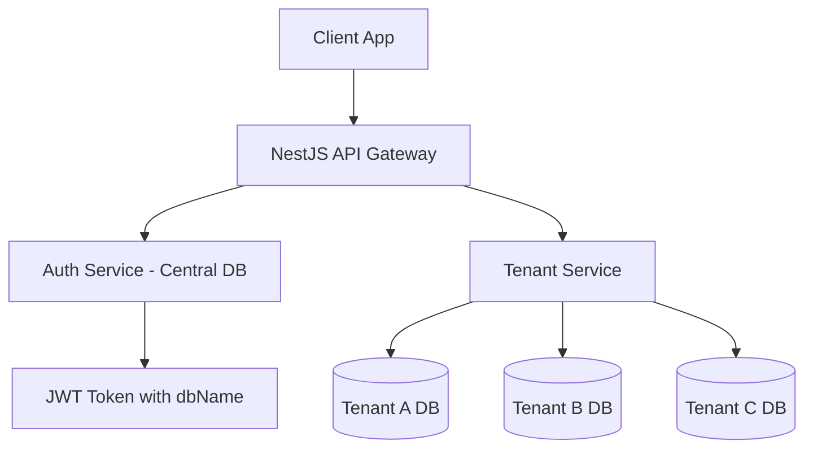

# OsonPOS Multi-Tenant Architecture Overview

This document outlines the architecture and workflows implemented for the **osonpos_server**. The system uses a **Database-per-Tenant** isolation strategy, ensuring high security and scalability.

## 1. High-Level Architecture

The system consists of two main database layers:
1.  **Admin (Central) Database**: Stores shared data like Businesses (`A_Business`) and global User records (`A_User`).
2.  **Tenant (Isolated) Databases**: Each business has its own physical PostgreSQL database (e.g., `abbos_dev`, `tenant_abc`). All business operations (Orders, Items, Employees) happen here.



---

## 2. The Core Components

### A. Authentication & Identification (`/src/auth`)
- **Flat Models**: `A_User` and `A_Business` are no longer linked by Prisma relations. They use `business_id` (String) for manual lookup.
- **JWT Payload**: On login, the server retrieves the `db_name` from `A_Business` and embeds it in the token.
- **Roles**: Built-in support for `OWNER`, `ADMIN`, `MANAGER`, and `CASHIER`.

### B. Tenant Management (`/src/tenant`)
- **`TenantService`**: The engine of the app. It dynamically creates Prisma Clients based on the `dbName` found in the request.
- **Connection Pooling**: Uses `pg` pools for efficient database connections, preventing memory leaks and high latency.

### C. Automated Migrations (`/scripts/migrate-tenants.ts`)
- Scans the `A_Business` table in the Admin DB.
- Iterates through every tenant and applies the current `schema.prisma` using `prisma db push`.

---

## 3. The Workflows

### New Tenant Registration Flow
1.  Client calls `POST /auth/register`.
2.  Server creates a record in `A_Business` and defines a unique `db_name`.
3.  Server creates the Owner in `A_User`.
4.  Server runs `CREATE DATABASE <db_name>` on the PostgreSQL server.
5.  Server runs `npx prisma db push` against the new database to initialize tables.

### Daily Operation Flow (Transparent Multi-Tenancy)
1.  Client logs in and receives a token.
2.  Client calls an endpoint: `GET /inventory/items`.
3.  **Interceptor**: The `JwtAuthGuard` validates the token and attaches user info (including `dbName`) to `req.user`.
4.  **Service**: The `InventoryService` calls `tenantService.getClient(req.user.dbName)`.
5.  **Response**: Data is fetched **only** from that tenant's database.

---

## 4. Development Workflow

### Changing the Database Schema
If you need to add a new field (e.g., adding `age` to `S_Employee`):
1.  Update `prisma/schema.prisma`.
2.  Run `npx prisma generate` to update types.
3.  Apply to the central DB: `npx prisma db push`.
4.  **Apply to all tenants**: `npm run migrate:tenants`.

### Security Checkpoints
- **Controllers**: Use `@UseGuards(JwtAuthGuard, RolesGuard)` and `@Roles('OWNER', 'ADMIN')`.
- **Data Isolation**: Never use the `PrismaService` (Central DB) for business data. Always use `TenantService`.

---

## 5. Directory Structure
```text
src/
├── auth/                 # Central Auth, JWT, Roles
├── prisma/               # Central Database Service
├── tenant/
│   ├── controllers/      # Multi-tenant API endpoints
│   ├── services/         # Multi-tenant business logic
│   ├── dto/              # Request validation
│   ├── tenant.service.ts # Dynamic DB connector
scripts/
└── migrate-tenants.ts    # Global schema sync script
```
